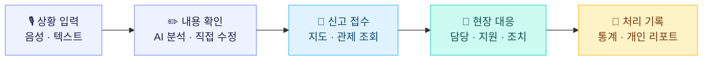

# ONCUE

### 사람 · 공간 · 상황을 연결하는 행사 현장 운영 플랫폼

행사의 모든 순간, 필요한 도움이 제때 되도록.

**🏆 2026 SKTHON 우수상 · 10팀 중 3등**

서경대학교 멋쟁이사자 주관

[발표 자료](assets/hackathon/final-presentation.pptx) · [서비스 흐름](#서비스-흐름) · [실행 안내](#실행과-개발-기록)

---

## 해커톤 결과

| 🏆 수상 | 🎂 팀 | 📁 상태 |
|:---:|:---:|:---:|
| **우수상 · 10팀 중 3등** | Team 08 · 저 오늘 생일입니다 축하해 주세요 | 해커톤 종료 · 결과물 보존 |

  

  <a href="assets/hackathon/final-presentation.pptx"><strong>📎 최종 발표 자료 다운로드 — PPTX, 약 18 MB</strong></a>

## ONCUE 소개

행사 현장에서는 익숙하지 않은 장소에 투입된 스태프도 상황과 위치를 빠르게 전달해야 합니다. **ONCUE는 현장의 신고부터 관리자의 대응과 처리 기록까지 하나의 흐름으로 연결합니다.**

| 현장 스태프 | 관리자 | 운영 기록 |
|---|---|---|
| 음성·텍스트로 상황 전달 | 지도에서 신고 위치와 상황 확인 | 신고·처리 현황 확인 |
| AI 분석 결과 확인·수정 후 접수 | 담당 배정·지원·조치 완료 | 관리자 본인의 처리 내역을 PDF로 보존 |

## 서비스 흐름

## 팀

| 역할 | 팀원 |
|---|---|
| PO | 강지민 |
| FE | 서찬우 |
| BE | 박경원 · 박제형 |
| UI | 한다나 |

## 기술 구성

| 프론트엔드 | 백엔드 | 데이터 · 외부 연동 |
|---|---|---|
| React · TypeScript | Python 3.13 · FastAPI | SQLite / PostgreSQL · Alembic |
| Vite · Tailwind CSS | uv · SQLAlchemy | OpenAI · VWorld 3D 지도 |

## 실행과 개발 기록

| 바로가기 | 내용 |
|---|---|
| [프론트엔드 실행](frontend/README.md) | 설치, 환경 변수, 시연·관리자·스태프 화면 |
| [백엔드 실행](backend/README.md) | 서버·DB 설정, 데모 데이터, 검사 명령 |
| [개발 문서](docs/index.md) | 요구사항·설계·API 계약과 종료 시점의 구현 기록 |
| [해커톤 자료](assets/hackathon/) | 수상 사진과 최종 발표 원본 |

<strong>프로젝트 종료 상태와 검증 범위</strong>

해커톤은 종료되었으며 현재 추가 개발 계획은 없습니다. 이 저장소는 최종 결과물과 개발 기록을 보존합니다. 초기 문서의 **‘현장의 지금’**은 최종 발표의 **ONCUE**와 같은 프로젝트입니다.

- **구현·확인:** 백엔드 API와 DB 테스트, 관리자·스태프 로그인 및 화면 연결, 지도 연동, 관리자 PDF 생성. 세부 근거는 [프론트 연동 PR #75](https://github.com/sku-hackathon-team08/team08/pull/75), [PDF 개선 PR #77](https://github.com/sku-hackathon-team08/team08/pull/77)에 있습니다.
- **미검증:** 브라우저에서 신고 입력부터 접수·담당·종결·PDF 다운로드까지 이어지는 전체 흐름, 실제 기기와 통신 복구, 배포 환경의 동작. 부분 검증을 전체 기능 검증으로 표시하지 않습니다.
- **범위 제외:** 행사 신청·발급, GPS·구역 판정·접근 경로. 당시 검토안과 미정 사항은 개발 기록으로 남겨두었습니다.

