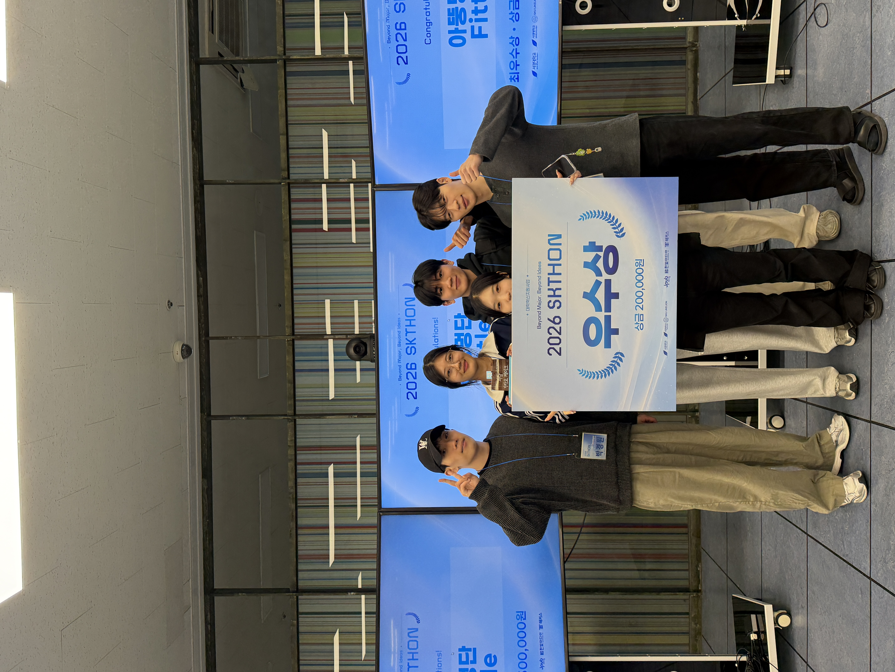

# ONCUE — 행사 현장 운영 플랫폼

> 행사의 모든 순간, 필요한 도움이 제때 되도록.

**ONCUE**는 사람·공간·상황을 연결하는 행사 현장 운영 플랫폼입니다. 현장 스태프의 음성·텍스트 신고를 지도와 연결해, 관리자가 상황을 파악하고 담당 배정부터 지원·조치 완료까지 관리할 수 있도록 돕습니다.

**2026 SKTHON · 서경대학교 멋쟁이사자 주관 · 10팀 중 3등, 우수상 수상**

## 해커톤 결과

| 항목 | 내용 |
|---|---|
| 행사 | 2026 SKTHON |
| 주관 | 서경대학교 멋쟁이사자 |
| 팀 | Team 08 · 저오늘생일입니다축하해주세요 |
| 결과 | **10팀 중 3등 · 우수상** |
| 프로젝트 상태 | 해커톤 종료 · 현재 추가 개발 계획 없음 |

  

### 최종 발표 자료

**[최종 발표 자료 다운로드 (PPTX · 약 18 MB)](assets/hackathon/final-presentation.pptx)**

문제 정의, 사용자와 요구, 서비스 소개, 데모 및 비즈니스 구상을 담은 해커톤 최종 발표본입니다.

이 저장소는 해커톤 결과물과 개발 기록을 보존합니다. 개발 문서에서 사용한 **‘현장의 지금’**은 최종 발표의 **ONCUE**와 같은 프로젝트이며, 당시 명세와 검토 기록은 `docs/`에 남겨두었습니다.

## 어떤 문제를 해결하나요?

행사 현장은 단기간에 다양한 인력이 투입되고, 익숙하지 않은 장소에서 상황과 위치를 빠르게 전달해야 합니다. ONCUE는 현장 보고와 관리자 대응을 하나의 흐름으로 연결하고자 만들었습니다.

| 사용자 | 서비스 흐름 |
|---|---|
| 현장 스태프 | 음성·텍스트로 상황 입력 → 분석된 내용 확인 → 신고 접수 |
| 관리자 | 지도와 관제 화면에서 신고 확인 → 담당 배정·지원·조치 → 처리 현황 확인 |
| 행사 운영자 | 신고·처리 통계와 PDF 리포트로 운영 기록 확인 |

해커톤 구현 범위와 계약은 [해커톤 API](docs/api/hackathon.md)에 정리되어 있습니다. 발표 자료의 서비스 구상과 실제 구현·검증 범위는 구분하며, 세부 검증 기록은 관련 PR에서 확인할 수 있습니다.

## 팀

최종 발표 자료에 기재된 역할입니다.

| 역할 | 팀원 |
|---|---|
| PO | 강지민 |
| PE | 서찬우 |
| BE | 박경원, 박제형 |
| UI | 한다나 |

## 기술 구성

| 구분 | 기술 |
|---|---|
| 프론트엔드 | React · TypeScript · Vite · Tailwind CSS |
| 백엔드 | Python 3.13 · FastAPI · uv |
| 저장소 | SQLite / PostgreSQL · Alembic |
| AI 연동 | OpenAI 음성 변환·신고 구조화 분석 |

구성별 선택과 구현 범위는 [아키텍처](docs/architecture.md), [DB 계약](docs/db/storage.md), [OpenAI 연동 명세](docs/integrations/openai.md)를 참고하세요.

## 저장소 구성과 실행 안내

| 경로 | 내용 |
|---|---|
| [frontend/](frontend/README.md) | 프론트엔드 코드·실행 안내 |
| [backend/](backend/README.md) | 백엔드 코드·설치·실행·검증 안내 |
| [docs/](docs/index.md) | 요구사항·기능·기술 명세와 개발 기록 |
| [assets/hackathon/](assets/hackathon/) | 수상 사진·최종 발표 원본 |

로컬 실행 방법은 각 파트의 README를 참고하세요. 문서의 책임과 상태는 [SOT](docs/sot.md), 당시 개발 흐름은 [SDD](docs/sdd.md)에 기록되어 있습니다.
