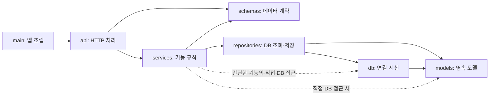

# 아키텍처

> 상태: 백엔드 레이어 기반 모놀리식·프레임워크·환경 관리·로컬 DB·비동기 기본 방식 확정. 프론트 스택은 확정했으며 프론트 폴더 구조와 배포 DB는 미정입니다.
> 기술 선택을 기록한 문서이며 앱·DB 연결의 구현 완료를 뜻하지 않습니다.

## 코드 구성

| 폴더 | 역할 | 기술 스택 |
|---|---|---|
| [frontend/](../frontend/) | 프론트엔드 코드 | Vite · React 19 · TypeScript · Tailwind CSS |
| [backend/](../backend/) | 백엔드 코드 | Python 3.13 · FastAPI |

## 저장소와 애플리케이션 경계

저장소는 프론트와 백엔드를 함께 관리하는 모노레포입니다.
백엔드는 **레이어 기반 모놀리식**으로 구성합니다. 기술적 역할을 기준으로 폴더를 나누고,
각 레이어 안에서 기능별 파일 또는 하위 패키지로 구분합니다. 전체 백엔드는 하나의 FastAPI 애플리케이션으로 실행·배포합니다.

예상 개발 규모가 크지 않아 코드의 역할과 위치를 쉽게 찾을 수 있는 구성을 선택했습니다.
프론트는 Vite 개발 서버로 실행하며 별도 배포 구성은 두지 않습니다. 프론트 정적 파일을 백엔드에서 제공할지는 아직 정하지 않았습니다. 백엔드 연결 주소와 CORS는 프론트·백엔드 계약 검토에서 관리합니다.

## 백엔드 레이어 구성

레이어별 패키지를 만들고, 앱 조립·상태 확인 라우터·응답 스키마를 분리했습니다.
`core/`, `services/`, `repositories/`, `models/`, `db/`는 패키지 경계만 준비한 상태입니다.
각 패키지의 `__init__.py`는 역할 설명만 담고 초기화 코드·재노출 import를 넣지 않습니다.

```text
backend/app/
├── __init__.py
├── main.py                  # FastAPI 앱 생성·최종 조립
├── api/
│   ├── router.py            # 기능 라우터 등록
│   └── routes/
│       └── health.py        # GET /health
├── schemas/
│   └── health.py            # HealthResponse
├── services/                # 기능 규칙·업무 흐름
├── repositories/            # 필요할 때 DB 조회·저장 분리
├── models/                  # 영속 데이터 모델·ORM 공통 기반
├── db/                      # DB 연결·세션 수명
└── core/                    # 공통 설정·HTTP에 독립적인 공통 오류
```

각 디렉터리에는 `__init__.py`가 있습니다. 기능별 파일은 실제 구현 시 같은 기능 이름으로 각 레이어에 추가합니다.
현재 `/health`에는 업무 규칙이나 DB 접근이 없어 라우터와 스키마만 사용합니다.
단순 전달만 하는 서비스·리포지토리, 범용 베이스 클래스·인터페이스는 만들지 않습니다.

### 의존 방향

아래 화살표는 **왼쪽 코드가 오른쪽 코드를 import하거나 사용하는 방향**이며, 응답 데이터가 돌아오는 방향과 다릅니다.
구현된 `/health` 경로는 `main → api/router → api/routes/health → schemas/health`입니다.
아래 그림은 이후 기능까지 적용할 기본 규칙이며 모든 레이어가 구현됐다는 뜻은 아닙니다.



`core`는 각 레이어가 필요할 때 사용하는 공통 기반으로, 그림에서는 생략했습니다.
`db → models`는 초기화·메타데이터 사용을 위한 방향이고, 조회·저장 업무 로직은 서비스 또는 리포지토리에 둡니다.

| 위치 | 책임 | 허용하는 다른 app 레이어 |
|---|---|---|
| `main.py` | 앱 생성, 라우터·오류 핸들러·시작/종료 조립 | 조립에 필요한 레이어. 다른 레이어는 main을 import하지 않음 |
| `api/routes/` | URL·HTTP 메서드, 입력·인증 의존성, 응답·상태 코드 | `services`, `schemas`, `core`. DB 조회를 직접 수행하지 않음 |
| `api/router.py` | 기능 라우터를 모아 등록 | `api/routes`. 개별 라우터는 이 파일을 역참조하지 않음 |
| `api/dependencies.py` (추후 필요 시) | FastAPI 의존성으로 서비스·세션 등을 연결 | 조립에 필요한 `services`, `repositories`, `db`, `core`. 업무 규칙·직접 쿼리는 두지 않음 |
| `services/` | 기능 규칙·업무 흐름, 모델을 응답 데이터로 변환 | `repositories`, `schemas`, `core`. 간단한 기능은 `db`, `models` 직접 사용 가능 |
| `repositories/` | DB 조회·저장 | `db`, `models`, `core`. HTTP 응답 스키마를 만들지 않음 |
| `db/` | 연결·세션 수명·DB 초기화 | `models`, `core` |
| `models/` | 영속 데이터 모델, ORM 공통 기반 | `core` |
| `schemas/` | Pydantic 요청·응답·서비스 데이터 계약 | `core`. ORM 모델·서비스·HTTP 처리에 의존하지 않음 |
| `core/` | 설정·공통 상수·공통 오류 | 다른 app 레이어를 import하지 않음 |

표는 프로젝트 내부 레이어 기준입니다. 표준 라이브러리·Pydantic·선택한 ORM 같은 외부 도구는 각 책임에 맞게 사용할 수 있습니다.
라우터는 FastAPI `Depends`로 조립된 세션 등을 전달받을 수 있지만, 쿼리·기능 규칙은 서비스에 위임합니다.
서비스의 직접 DB 접근은 작은 기능을 위한 기존 선택을 유지합니다. 중복 쿼리나 독립적인 저장 책임이 생기면 리포지토리로 옮깁니다.

### 순환 참조를 막는 규칙

- 하위 레이어에서 상위 레이어를 import하지 않습니다. 같은 레이어의 기능 파일 사이에도 상호 import를 만들지 않습니다.
- 모델·스키마는 서로 import하지 않습니다. ORM 모델을 응답 스키마로 바꾸는 코드는 서비스에서 조합합니다.
- 향후 ORM 공통 Base는 `models/base.py`에 둡니다. `models → db → models` 형태의 순환을 만들지 않도록 모델이 연결·세션을 import하지 않습니다. 아직 ORM·Base 구현은 없습니다.
- 서비스 오류는 일반 Python 예외 또는 HTTP에 독립적인 `core` 예외로 표현하고, API 경계에서 HTTP 응답으로 변환합니다. `HTTPException`·`Depends`·`Request`는 서비스·리포지토리·모델에 넣지 않습니다.
- `core`에 기능 로직을 모으거나 `__init__.py`에서 하위 모듈을 일괄 재노출해 경계를 우회하지 않습니다. 실제 정의가 있는 모듈을 직접 import합니다.
- `TYPE_CHECKING`이나 함수 내부 import로 의존 방향 위반을 숨기지 않습니다. 공통 데이터 계약의 위치 또는 기능 책임을 조정합니다.

레이어 규칙은 코드 리뷰 기준입니다. 현재 CI의 Ruff·Pyrefly는 이 표 전체를 자동 강제하지 않습니다.
새 기능의 구현 순서는 [백엔드 개발 가이드](guides/backend.md#기능-추가-순서)를 참고합니다.

## 프론트 환경

| 항목 | 선택 | 상태 |
|---|---|---|
| 빌드 도구 | Vite | 확정 |
| 프레임워크 | React 19 | 확정 |
| 언어 | TypeScript | 확정 |
| 스타일링 | Tailwind CSS v4 | 확정 |
| 라우팅 | react-router-dom v7 | 확정 |
| 서버 상태 | @tanstack/react-query v5 | 확정 |
| 패키지 관리자 | npm | 확정 |
| 폴더 구조 | 미정 | 후속 작업 |

npm으로 프론트 의존성을 관리하며 정확한 버전은
[`package.json`](../frontend/package.json)과 [`package-lock.json`](../frontend/package-lock.json)에서 관리합니다.
설치·실행·검사 명령은 [프론트 README](../frontend/README.md)에 기록했습니다.
선택 근거는 [결정 기록](decisions.md)의 D-021~D-024에 있습니다.

react-router는 `createBrowserRouter` 기반 데이터 라우터만 사용하고 프레임워크 모드는 쓰지 않습니다.
Tailwind는 v4 방식으로 `vite.config.ts` 플러그인과 CSS `@import`로 연결하며 `tailwind.config.js`를 두지 않습니다.
현재 라우터·QueryClientProvider·Tailwind 배선만 확인했으며 실제 화면과 API 연결은 후속 작업입니다.

## 백엔드 환경과 DB

| 항목 | 선택 | 상태 |
|---|---|---|
| Python | 3.13 | 확정, 현재 설치·검증 버전은 `backend/.python-version` 참고 |
| 웹 프레임워크 | FastAPI | 확정 |
| 가상환경·의존성 관리 | uv | 확정 |
| 로컬 개발 DB | SQLite | 확정 |
| 배포 DB | PostgreSQL 검토 | 후보, 미확정 |

uv로 백엔드의 가상환경과 의존성을 관리합니다. Python은 3.13 계열을 사용합니다.
현재 정확한 Python 버전은 [`backend/.python-version`](../backend/.python-version), 의존성은
[`pyproject.toml`](../backend/pyproject.toml)과 [`uv.lock`](../backend/uv.lock)에서 관리합니다.
로컬 설치·확인 명령은 [백엔드 README](../backend/README.md)에 기록했습니다.
CI는 같은 Python 버전과 잠금 파일을 사용합니다. 배포도 같은 기준을 적용할 예정입니다.

선택 근거는 FastAPI·LangGraph의 Python 3.13 지원 표기와 Python 3.13의 유지보수 기간입니다.
[FastAPI 배포 정보](https://pypi.org/project/fastapi/), [LangGraph 배포 정보](https://pypi.org/project/langgraph/),
[Python 지원 현황](https://devguide.python.org/versions/)을 참고했습니다.
LangGraph는 AI 기능을 도입할 때 검토할 후보이며 아직 의존성에 추가하지 않았습니다.
현재 최소 의존성의 설치·호환성을 검증했으며, AI·DB 패키지 조합은 해당 기능 도입 시 검증합니다.

PostgreSQL을 배포 DB로 채택할 경우 연결 설정·드라이버·스키마 관리 방식과 해당 DB에서의 통합 검증을 함께 정합니다.
DB 접근은 아래 비동기 기본 방식을 따르며, ORM·DB 드라이버·마이그레이션 도구는 DB 구현 때 정합니다.

## 동기·비동기 실행 방식

> 상태: 팀 합의로 확정. 상태 확인 라우터에 적용했으며, DB 구현과 동시 요청 성능 검증은 후속 작업입니다.

백엔드는 **비동기 입출력을 기본**으로 설계합니다. 외부 AI API 등 응답을 기다리는 동안 다른 요청을 처리할 수 있도록,
라우터와 입출력을 수행하는 서비스는 `async def`로 작성하고 비동기 클라이언트를 `await`합니다.
AI 사용은 아직 후보이며, 이 선택만으로 LangGraph 도입이나 처리 성능을 확정하지 않습니다.

| 작업 | 기본 방식 |
|---|---|
| API 라우터·외부 API 호출·DB 접근 | 비동기 함수와 비동기 입출력 도구 우선 |
| 짧은 계산·데이터 변환·Pydantic 검증 | 일반 `def`; 입출력이 없는 함수에 불필요한 `async`를 붙이지 않음 |
| 동기 전용 라이브러리의 오래 걸리는 입출력 | 동기 라우터·의존성 또는 명시적인 스레드풀 경계에서 실행 |
| 무거운 CPU 연산·로컬 모델 추론 | 별도 프로세스·작업 실행 구조 검토; `async def`만으로 해결하지 않음 |

SQLite와 PostgreSQL 모두 애플리케이션에서는 비동기 접근을 우선 검토합니다.
이것이 두 DB의 동시성·쓰기 처리 특성이 같다는 뜻은 아닙니다. 드라이버·연결 수명·트랜잭션과 실제 DB 검증은 후속 DB 작업에서 정합니다.
구현과 리뷰의 세부 기준은 [백엔드 실행 가이드](guides/backend.md#동기비동기-사용-기준)에 둡니다.

## 추후 정리할 내용

- 프론트·백엔드의 책임과 통신 방식
- 배포 DB 확정·DB 접근과 스키마 관리·외부 서비스·파일 저장 방식
- 실제 기능별 파일·DB 접근 도구·모델 구성
- 실행·배포 구성

선택의 이유는 [결정 기록](decisions.md), API 계약은 [API 문서](api/index.md), 데이터 등 계약은 [기술 명세](specs/index.md)에 작성합니다.
